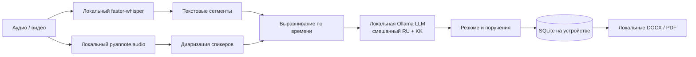

# QazMeeting AI

**On-premise AI помощник для протоколов встреч на русском, казахском и смешанной русско-казахской речи.** Проект создан для HackAlem. Demo Mode сразу показывает весь сценарий без скачивания моделей; адаптеры локальных AI сервисов отделены от пользовательского интерфейса и хранения.

## Проблема и решение

После встречи секретарю приходится вручную восстанавливать ход разговора, фиксировать решения, ответственных и сроки. QazMeeting AI формирует черновик протокола из записи: локальная речь-в-текст, диаризация, привязка текста к говорящим, извлечение поручений и краткое содержание. Секретарь проверяет результат, переименовывает участников, обновляет статусы и выгружает DOCX/PDF.

Поддержка трёх режимов речи заложена в выборе многоязычной модели распознавания и интерфейсе структурированного извлечения задач через локальную LLM. Например, «Азамат, осы отчетты ертең сағат үшке дейін дайындап, маған отправьте» должно интерпретироваться как ответственное лицо Азамат, задача подготовить и отправить отчёт, срок завтра в 15:00. Demo содержит русские, казахские и смешанные реплики.

## Возможности MVP

- Дашборд встреч и счётчики поручений, просроченных и выполненных задач.
- Протокол встречи с именами спикеров, таймкодами, резюме и поручениями.
- Изменение имени участника и статуса поручения.
- Контекст-источник и confidence у каждого поручения.
- Экспорт протокола в DOCX и PDF.
- Demo Mode с тремя участниками и локальной демонстрационной SQLite базой.
- Модульные сервисы для faster-whisper, pyannote.audio и Ollama-совместимой локальной модели.

## Архитектура и приватность



Runtime не обращается к OpenAI API и не отправляет аудио или текст во внешние AI API. Ollama adapter использует настроенный локальный endpoint (`localhost:11434` по умолчанию); его запросы остаются в инфраструктуре оператора. Веб-интерфейс и API обслуживаются тем же FastAPI процессом. Шрифты и ресурсы UI встроены и не требуют внешнего CDN. Секретари должны соблюдать доступ ОС/сети к машине с данными.

## Структура

```text
app/
  main.py                    FastAPI routes, dashboard, meeting, edits, exports
  config.py                  Environment configuration
  database.py                SQLite schema and sample meeting
  services/
    transcription.py         Transcriber interface; demo / faster-whisper
    diarization.py           Diarizer interface; demo / pyannote.audio
    alignment.py             Timestamp overlap alignment
    speakers.py              Speaker display-name operation
    intelligence.py          Text intelligence; demo / local Ollama
    exports.py                DOCX and PDF generation
  static/                    Responsive HTML, CSS, JavaScript UI
requirements.txt
.env.example
```

## Быстрый запуск на Windows (PowerShell)

Требуется Python 3.10–3.12. В PowerShell из каталога репозитория:

```powershell
py -3 -m venv .venv
.\.venv\Scripts\Activate.ps1
python -m pip install -r requirements.txt
$env:DEMO_MODE = "true"
python -m uvicorn app.main:app --host 127.0.0.1 --port 8000
```

Откройте <http://127.0.0.1:8000>. Demo Mode включён по умолчанию; обязательное значение можно задать явно приведённой выше командой. Первый запуск создаёт `data/qazmeeting.db` и добавляет демонстрационную встречу. Удалите этот локальный файл, чтобы очистить демо данные и начать заново. Не размещайте в нём реальные данные без надлежащих прав доступа.

Для Linux/macOS: `python -m venv .venv`, `source .venv/bin/activate`, `pip install -r requirements.txt`, `DEMO_MODE=true uvicorn app.main:app --host 127.0.0.1 --port 8000`.

## Как показать demo

1. Откройте дашборд. Баннер **Демо-режим** показывает, что используются sample data.
2. Откройте встречу «Q1 product planning: Алматы командасы».
3. Покажите реплики на русском, қазақша и смешанной речи, переименуйте участника (Enter сохраняет).
4. Покажите сроки, контекст, confidence и смену статуса поручения.
5. Скачайте DOCX и PDF. Всё содержимое демонстрации хранится локально в SQLite.

Новая встреча создаёт карточку-заготовку. Полная загрузка и обработка записи в интерфейсе в этом MVP ещё не подключена: модели обычно требуют настройки и ресурсов, поэтому demo запускается сразу без них. Не загружайте конфиденциальные записи в эту версию.

## Полный локальный AI режим

AI адаптеры выбираются настройкой окружения. В production установите соответствующие локальные Python зависимости и модели отдельно, настройте self-hosted Ollama и `DEMO_MODE=false`. Пример настроек находится в `.env.example` (переменные можно экспортировать в PowerShell; приложение намеренно не читает `.env` автоматически). Необходимые real-mode Python пакеты (faster-whisper, pyannote.audio и их backend, включая PyTorch) не входят в минимальный demo `requirements.txt` — их версии и способы развёртывания зависят от целевого оборудования и сети. Эта первая версия не скачивает модели и пока не соединяет цепочку загрузки файла → распознавание → сохранение нового протокола. Настройка приватного локального endpoint Ollama обязательна; не указывайте публичный endpoint.

Статус компонентов:

| Компонент | Сейчас | Для интеграции в production |
|---|---|---|
| SQLite, API, dashboard, edits | Работает локально | Аутентификация, роли, резервное копирование и миграции |
| Demo transcript, diarization и LLM | Реалистичные sample данные | Заменить demo реализации локальными адаптерами |
| faster-whisper adapter | Локальный adapter-класс | Установить пакет/модель и подключить обработку загрузки |
| pyannote adapter и alignment | Локальный adapter-класс и overlap alignment | Настроить совместимую модель/диаризацию; проверить качество на RU/KK |
| Ollama text intelligence | Локальный HTTP интерфейс, JSON извлечение | Настроить модель, валидировать JSON и проверить качество RU/KK дат |
| DOCX / PDF | Экспорт локальных протоколов | Шрифтовая проверка казахских глифов и шаблон организации |

В local-AI mode загрузка ещё не подключена к сквозной обработке, и endpoint Ollama должен быть настроен вручную. Возможности diarization для казахской речи, смешанных фраз и определение ответственного требуют проверки на записях реальных встреч с согласия участников. В демонстрационном стенде намеренно приведены вымышленные участники и содержимое.

## Воспроизводимость и конфиденциальные файлы

`data/`, записи (`wav`, `mp3`, `m4a`, `mp4`), `.env`, базы SQLite и экспорты исключены из Git через `.gitignore`. Храните записи и секреты только в контролируемом локальном хранилище. Зависимости demo малы относительно речевых моделей; модели автоматически не скачиваются.

## Дальнейшая разработка

- Интеграция с Zoom, Teams и Google Meet.
- Напоминания об истекающих сроках.
- Интеграция с электронным документооборотом.
- Улучшенная голосовая идентификация и сопоставление участников.
- Развёртывание в закрытой сети с ролями, аудитом и управлением моделями.

## Технологии и лицензии

Python, FastAPI, SQLite, HTML/CSS/JavaScript, python-docx, ReportLab. Локальный STT планируется на faster-whisper, diarization — на pyannote.audio-совместимой pipeline, языковая обработка — через self-hosted Ollama-интерфейс. Проверяйте лицензии выбранных моделей и библиотек перед использованием в организации.
